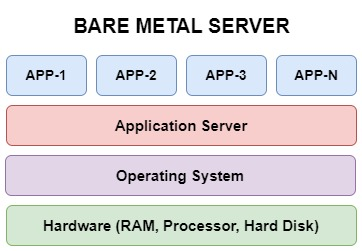
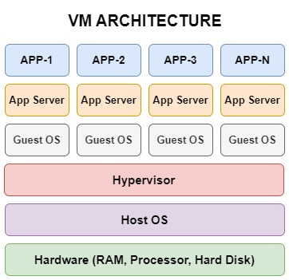
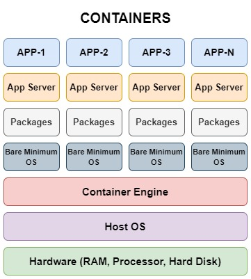
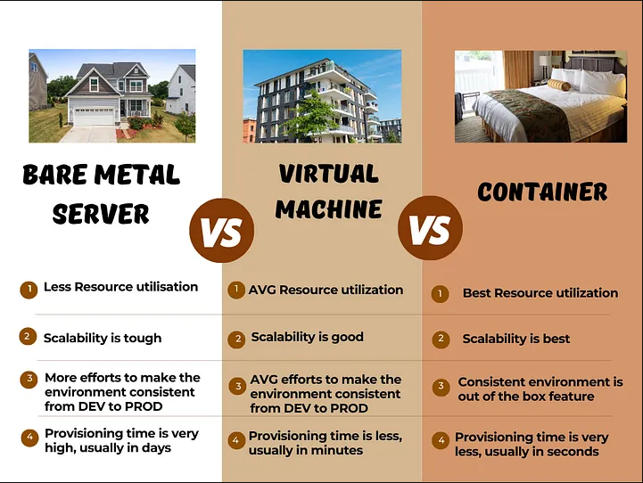
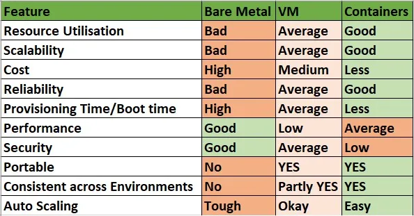

# Physical Servers, Virtualization, and Containerization
Previsouly we have seen Java applications as EAR(Enterprise archive), WAR(Web Archive) files. Memory of these applications are quite high. We deployed them into Bare metal servers (physical servers).

Now a days everywhere we are talking about Microservices. These microservice applications are very thin in size. Containers are the best choice to deploy these microservices because of its smaller in size.

## PHYSICAL SERVERS

In the past, companies used physical servers to run their applications. A physical server is a large computer that runs a specific application. Each server had its own CPU, memory, and storage, which often left many resources unused.

**Key Points:**
* **One Server, One Job:** Each server was dedicated to a single application.
* **Wasteful:** Servers were often underused, wasting resources like CPU and memory.
* **Expensive:** You needed many servers to run different applications, making it costly to manage.

## VIRTUALIZATION

Virtualization allows us to run many virtual machines (VMs) on a single physical server. A VM is like a separate computer inside a server, with its own operating system.

**Key Benefits:**
* **Better Use of Resources:** Many VMs can share the resources of one server, making it more efficient.
* **Cost Savings:** Fewer physical servers are needed, reducing hardware costs.
* **Flexibility:** VMs can be created, removed, or moved easily from one server to another.
* **Security:** VMs are isolated from each other, so problems in one VM won’t affect the others.

**Popular Virtualization Tools:**
* VMware
* Hyper-V

## CONTAINERIZATION

Containerization allows us to package applications and their dependencies into small, portable containers. Unlike VMs, containers share the same operating system, making them faster and more lightweight.

From Application point of view, we don’t care about the underlying OS. All we need is application should run properly with minimum resources. Ofcourse security should be taken care.

**Working in DEV but not working in PROD is the universal problem**. This is because we often take more care of PROD servers but not DEV servers. So there is always a mismatch between the packages and their versions among NON-PROD and PROD servers.

We can create application as a complete suit of `<b>OS + Packages required + Application Runtime + Application Code`

This complete suit is called `image`. Underlying Host OS can be anything but this image works exactly same in all environments. OS used by images can be bare minimum usually will not have unnecessary packages.

**Why Containers Are Better:**
* **Faster and Smaller:** Containers start quickly and use fewer resources than VMs.
* **Portable:** Containers can run the same way across different environments (like development, testing, and production).
* **Great for Scaling:** Containers are perfect for applications that need to grow and handle more traffic.
* **Efficient Use of Resources:** More containers can run on the same hardware compared to VMs.

**Popular Container Tools:**
* Docker
* OpenShift
* Kubernetes (to manage containers)

## Comparison: Physical Servers, Virtualization, and Containers

We can assume,
* `Bare metal servers` as independent landed houses
* `Virtual Machine` as multi floor apartment
* `Container` as a single room 

Let’s compare the features among Bare metal, VM and Containers from Application perspective

We can notice Security and performance features are lacking in Containers when compared to bare metal. Here, we can achieve security and performance using some methods.

