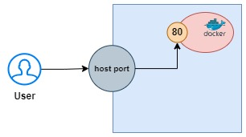

Docker is an open-source platform that enables developers to automate the deployment, scaling, and management of applications using containerization. It allows you to package applications and their dependencies into containers, which are lightweight, portable, and consistent across different environments.

## Installation of Docker

We will install `docker` using the rpm repository

Before you install Docker Engine for the first time on a new host machine, you need to set up the Docker repository. Afterward, you can install and update Docker from the repository.

**1. Set up the repository** 

Install the `yum-utils` package (which provides the `yum-config-manager` utility) and set up the repository.

We need sudo access to run the docker commands
```
sudo su -
```
Now, we can run the following commands to setup repository
```
yum install yum-utils -y 
```
```
yum-config-manager --add-repo https://download.docker.com/linux/rhel/docker-ce.repo
```

**2. Install Docker Engine**

To install the latest version, run:
```
yum install docker-ce docker-ce-cli containerd.io docker-buildx-plugin docker-compose-plugin -y
```

**start docker**
```
systemctl start docker
```

**Check status of docker**
```
systemctl status docker
```
`when docker is installed a group called docker is created.`

 We know that without sudo access, docker commands won't work. If we want to run docker commands from normal user (ec2-user), then add `ec2-user` to the docker group as secondary group

```
sudo usermod -aG docker ec2-user
```
After applying this command, it will not get refelected immediately. So, exit once and login again to see changes. Now, we can run docker commands without sudo access.

**Points to Remember**

* In AWS, when we run AMI then we call it as instance (VM is the running instance of AMI)
* In Docker, when we run image then we call it as container (Container is the running instance of image)
* Image is a static file and it has some memory. When we run this image, we will something called container 
* We can run one docker image in any number of servers

## Docker Commands

 * **1. To check the running containers** * 
```
docker ps
```
```
docker ps -a
```
Here, `-a` represents all

*2. To display docker images that are available in server*
```
docker images
```
*3. To pull the images from docker repository/hub*
```
docker pull image-name
```
> NOTE: <br>
If we don't mention the version, then it will take latest version by default

We can signup in `docker-hub` website
* From here, we can pull the images that we required.
* Suppose if we pushed our customized image to docker hub and same like another person also pushed their image with same name to the docker hub then we will get confuse by this. So, docker gives path format `username/image-name:version`  
* Using this format, we can push our images to docker hub

*4. To create container from docker image*
```
docker create image-name:version
```
or
```
docker create image-id
```
*5. To run container*
```
docker start container-id
```
*6. To stop container*
```
docker stop container-id
```
*7. To remove container*
```
docker rm container-id
```
before running this command, we need to stop the container
```
docker rm -f container-id
```
Here `-f` represents forcefully which will remove running container without stopping it

*8. To remove images*
```
dcoker rmi image-id
```
Here `i` represents image

*9. To pull image and create container and start it will single command*
```
docker run image-name
```
> This commands run in foreground. So that, it will block the screen

Here docker run command internally pulls the docker image and it will create container and gets started automatically

`docker run = docker pull + create + start`

*10. To run a container in background*
> How can you run a container in background?

```
docker run -d image-name
```
Here, `-d` represents detached mode. When this flag is used, the container runs in the background, allowing you to continue using the terminal.
 
*11. To access specific ports*
> How can we access nginx running inside the container?

* Container is like a nano/mini server. It also have 0-65,535 ports
* When we install nginx in VM, we can access it in browser through IP Address:80
* But here, the first request comes to host-port from the user and it will be mappped to container-port.



```
docker run -d -p host-port:container-port image-name
```
Here `-p` represents port-forwarding which will map `container ports` to `host ports`

`-p` option is essential for accessing services running in a container from outside the container

Now, we can access nginx in the browser.

> Here, we can give any port for the `host-port`

Using one image, we can create many containers. We can place different websites in different containers using one image.

*12. To login to container*
> How to get access to running container?

```
docker exec -it container-id bash
```
Here, `exec` represents execute and `-it` represents interactive terminal 

Now, we are inside the container

* Here, we can go to the path `/usr/share/nginx/html/` and remove the default `index.html` page 
* Create a simple index.html with command `echo "<h1>Hi, Iam from CONATAINER</h1>" > index.html`
* Now, if we access it on browser, we will get this message `Hi, Iam from CONATAINER` on the screen

*13. To get full details of container*
```
docker inspect container-id
```

*14. To get logs of container*
```
docker logs container-id
```

*15. To set name for container*
```
docker run -d -p host-port:container-port --name container-name image-name
```
By default, docker will set random name to container by picking two names from dictionary and it will combine them by underscore

We can check everything by using container name

## Docker File
A Dockerfile is a text document that contains a series of docker instructions for building a custom Docker image.
* **FROM** : Specifies the base image from which to build
* **RUN** : Executes commands in the image during the build process
* **COPY** : Copies files or directories from the host machine to the image
* **ADD** : Similar to `COPY`, but also supports extracting tar files and fetching files from URLs
* **CMD** : Specifies the default command to run when a container is started from the image. Only one CMD instruction is allowed in a Dockerfile
* **ENTRYPOINT** : Configures a container to run as an executable. It allows you to set default parameters for the container
* **ENV** : Sets environment variables in the image
* **EXPOSE** : Documents the port that the container listens on at runtime. This does not actually publish the port; it’s mainly for documentation purposes
* **WORKDIR** : Sets the working directory for subsequent instructions